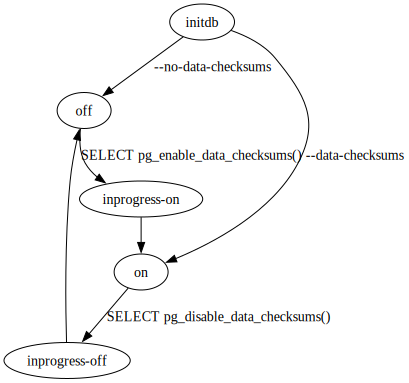

## Data Checksums

 By default, data pages are protected by checksums, but this can optionally be disabled for a cluster. When enabled, each data page includes a checksum that is updated when the page is written and verified each time the page is read. Only data pages are protected by checksums; internal data structures and temporary files are not.

 Checksums can be disabled when the cluster is initialized using [initdb](../../reference/postgresql-server-applications/initdb.md#app-initdb-data-checksums). They can also be enabled or disabled at a later time either as an offline operation or online in a running cluster allowing concurrent access. Data checksums are enabled or disabled at the full cluster level, and cannot be specified individually for databases, tables or replicated cluster members.

 The current state of checksums in the cluster can be verified by viewing the value of the read-only configuration variable [data_checksums](../server-configuration/preset-options.md#guc-data-checksums) by issuing the command `SHOW data_checksums`.

 When attempting to recover from page corruptions, it may be necessary to bypass the checksum protection. To do this, temporarily set the configuration parameter [ignore_checksum_failure](../server-configuration/developer-options.md#guc-ignore-checksum-failure).
 

### Offline Enabling of Checksums

 The [pg_checksums](../../reference/postgresql-server-applications/pg_checksums.md#app-pgchecksums) application can be used to enable or disable data checksums, as well as verify checksums, on an offline cluster.
  

### Online Enabling of Checksums

 Checksums can be enabled or disabled online, by calling the appropriate [functions](../../the-sql-language/functions-and-operators/system-administration-functions.md#functions-admin-checksum).

 Both enabling and disabling data checksums happens in two phases, separated by a checkpoint to ensure durability. The different states, and their transitions, are illustrated in [data checksums states](#data-checksums-states-figure) and discussed in further detail in this section.

 

**data checksums states**

 Enabling checksums will set the cluster checksum state to `inprogress-on`. During this time, checksums will be written but not verified. In addition to this, a background worker process is started that enables checksums on all existing data in the cluster. Once this worker has completed processing all databases in the cluster, the checksum state will automatically switch to `on`. The processing will consume two background worker processes, make sure that `max_worker_processes` allows for at least two more additional processes.

 The process will initially wait for all open transactions to finish before it starts, so that it can be certain that there are no tables that have been created inside a transaction that has not committed yet and thus would not be visible to the process enabling checksums. It will also, for each database, wait for all pre-existing temporary tables to get removed before it finishes. If long-lived temporary tables are used in an application it may be necessary to terminate these application connections to allow the process to complete.

 If the cluster is stopped while in `inprogress-on` state, for any reason, or processing was interrupted, then the checksum enable process must be restarted manually. To do this, re-execute the function `pg_enable_data_checksums()` once the cluster has been restarted. The process will start over, there is no support for resuming work from where it was interrupted. If the cluster is stopped while in `inprogress-off`, then the checksum state will be set to `off` when the cluster is restarted.

 Disabling data checksums will set the data checksum state to `inprogress-off`. During this time, checksums will be written but not verified. After all processes acknowledge the change, the state will automatically be set to `off`.

 Disabling data checksums while data checksums are actively being enabled will abort the current processing.
 

#### Impact on system of online operations

 Enabling data checksums can cause significant I/O to the system, as all of the database pages will need to be rewritten, and will be written both to the data files and the WAL. The impact may be limited by throttling using the `cost_delay` and `cost_limit` parameters of the `pg_enable_data_checksums()` function.

-  I/O: all pages need to have data checksums calculated and written which will generate a lot of dirty pages that will need to be flushed to disk, as well as WAL logged.
-  Replication: When the standby receives the data checksum state change in the WAL stream it will issue a * restartpoint* in order to flush the current state into the `pg_control` file. The restartpoint will flush the current state to disk and will block redo until finished. This in turn will induce replication lag, which on synchronous standbys also blocks the primary. Reducing [max_wal_size](../server-configuration/write-ahead-log.md#guc-max-wal-size) before the process is started can help with reducing the time it takes for the restartpoint to finish.
-  Shutdown/Restart: If the server is shut down or restarted when data checksums are being enabled, the process will not resume and all pages need to be recalculated and rewritten. Enabling data checksums should be done when there is no need for regular maintenance or during a service window.

 No I/O is incurred when disabling data checksums, but checkpoints are still required.
