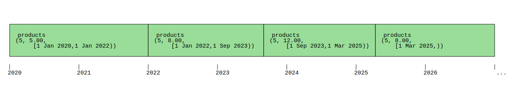
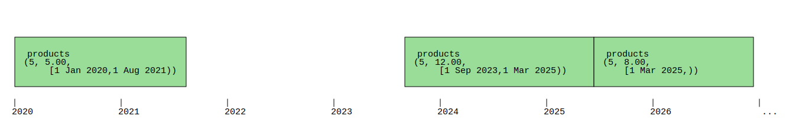
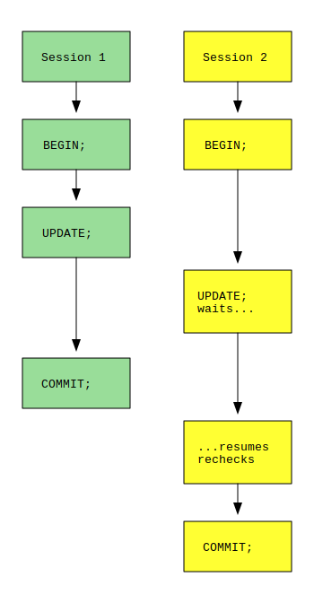

<a id="dml-application-time-update-delete"></a>

## Updating and Deleting Temporal Data


 Special syntax is available to update and delete from application-time temporal tables (see [Application Time](../data-definition/temporal-tables.md#ddl-application-time)). (No extra syntax is required to insert into them: the user just provides the application time values like any other column.) When updating or deleting, the user can target a specific portion of history. Only rows overlapping that history are affected, and within those rows only the targeted history is changed. If a row contains more history beyond what is targeted, its application time is reduced to fit within the targeted portion, and new rows are inserted to preserve the history that was not targeted.


 Recall the example table from [Application Time Example](../data-definition/temporal-tables.md#temporal-entities-figure), containing this data:

```

 product_no | price |        valid_at
------------+-------+-------------------------
          5 |  5.00 | [2020-01-01,2022-01-01)
          5 |  8.00 | [2022-01-01,)
          6 |  9.00 | [2021-01-01,2024-01-01)
```
 A temporal update might look like this:

```sql

UPDATE products
  FOR PORTION OF valid_at FROM '2023-09-01' TO '2025-03-01'
  SET price = 12.00
  WHERE product_no = 5;
```
 That command will update the second record for product 5. It will set the price to 12.00 and the application time to `[2023-09-01,2025-03-01)`. Then, since the row's application time was originally `[2022-01-01,)`, the command must insert two *temporal leftovers*: one for history before September 1, 2023, and another for history since March 1, 2025. After the update, the table has four rows for product 5:

```

 product_no | price |        valid_at
------------+-------+-------------------------
          5 |  5.00 | [2020-01-01,2022-01-01)
          5 |  8.00 | [2022-01-01,2023-09-01)
          5 | 12.00 | [2023-09-01,2025-03-01)
          5 |  8.00 | [2025-03-01,)
          6 |  9.00 | [2021-01-01,2024-01-01)
```
 The new history could be plotted as in [Temporal Update Example](#temporal-update-figure).
 <a id="temporal-update-figure"></a>

**Temporal Update Example**





 Similarly, a specific portion of history may be targeted when deleting rows from a table. In that case, the original rows are removed, but new *temporal leftovers* are inserted to preserve the untouched history. The syntax for a temporal delete is:

```sql

DELETE FROM products
  FOR PORTION OF valid_at FROM '2021-08-01' TO '2023-09-01'
  WHERE product_no = 5;
```
 Continuing the example, this command would delete two records. The first record would yield a single temporal leftover, and the second would be deleted entirely. The rows in the table would now be:

```

 product_no | price |        valid_at
------------+-------+-------------------------
          5 |  5.00 | [2020-01-01,2021-08-01)
          5 | 12.00 | [2023-09-01,2025-03-01)
          5 |  8.00 | [2025-03-01,)
          6 |  9.00 | [2021-01-01,2024-01-01)
```
 The new history could be plotted as in [Temporal Delete Example](#temporal-delete-figure).
 <a id="temporal-delete-figure"></a>

**Temporal Delete Example**





 Instead of using the `FROM ... TO ...` syntax, temporal update/delete commands can also give the targeted range/multirange directly, inside parentheses. For example: `DELETE FROM products FOR PORTION OF valid_at ('[2028-01-01,)') ...`. This syntax is required when application time is stored in a multirange column.


 When application time is stored in a range type column, zero, one or two temporal leftovers are produced by each row that is updated/deleted. With a multirange column, only zero or one temporal leftover is produced. The leftover bounds are computed using `range_minus_multi` and `multirange_minus_multi` (see [Range/Multirange Functions and Operators](../functions-and-operators/range-multirange-functions-and-operators.md#functions-range)).


 The bounds given to `FOR PORTION OF` must be constant. Functions like `now()` are allowed, but column references are not.


 When temporal leftovers are inserted, all `INSERT` triggers are fired, but permission checks for inserting rows are skipped.


 In `READ COMMITTED` mode, temporal updates and deletes can yield unexpected results when they concurrently touch the same row. It is possible to lose all or part of the second update or delete. The scenario is illustrated in [Temporal Isolation Example](#temporal-isolation-figure). Session 2 searches for rows to change, and it finds one that Session 1 has already modified. It waits for Session 1 to commit. Then it re-checks whether the row still matches its search criteria (including the start/end times targeted by `FOR PORTION OF`). Session 1 may have changed those times so that they no longer qualify.


 In addition, the temporal leftovers inserted by Session 1 are not visible within Session 2's transaction, because they are not yet committed. Therefore there is nothing for Session 2 to update/delete: neither the modified row nor the leftovers. The portion of history that Session 2 intended to change is not affected.
 <a id="temporal-isolation-figure"></a>

**Temporal Isolation Example**





 To solve these problems, precede every temporal update/delete with a `SELECT FOR UPDATE` matching the same criteria (including the targeted portion of application time). That way the actual update/delete doesn't begin until the lock is held, and all concurrent leftovers will be visible. In higher transaction isolation levels, this lock is not required.
